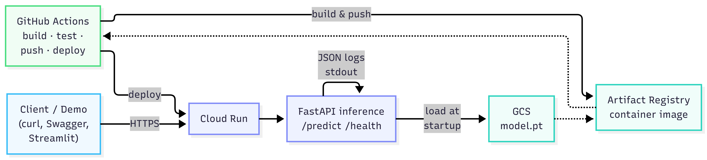

# ECG Arrhythmia Classification — Inference Service on GCP

A containerized ML inference service that classifies heartbeats from raw ECG
signals. A small 1D CNN trained on the MIT-BIH Arrhythmia Database runs
behind a FastAPI service, deployed to Google Cloud Run with the model
artifact served from GCS. CI runs on every PR.

The project is engineered as a deployment exercise, not a modelling
contribution: the model is deliberately small and conventional. The point
is the system around it.

## Live demo

- **Interactive web demo:** <https://ecg-demo-707486058219.europe-west1.run.app>
  Pick a MIT-BIH sample, hit "Classify beats", see per-beat predictions
  overlaid on the signal.
- API service: <https://ecg-api-lvij6dnkaa-ew.a.run.app>
- API docs (Swagger UI): <https://ecg-api-lvij6dnkaa-ew.a.run.app/docs>
- Health: <https://ecg-api-lvij6dnkaa-ew.a.run.app/health>

> Both services scale to zero when idle. The first interaction may take
> 20–30 seconds while both containers cold-start; subsequent requests
> respond in tens of milliseconds.

Example API request:

```bash
curl -X POST https://ecg-api-lvij6dnkaa-ew.a.run.app/predict \
  -H "Content-Type: application/json" \
  -d '{"signal": [/* 650+ float samples */], "fs": 360}'
```

## Architecture



The system is two Cloud Run services in `europe-west1`: a FastAPI
inference service (`ecg-api`) that loads its model from GCS at startup,
and a Streamlit demo client (`ecg-demo`) that calls the API. Container
images live in Artifact Registry; the model artifact lives in GCS,
versioned under `models/v1.0.0/model.pt`.

## Pipeline

Raw ECG signal (single-channel, any length ≥ ~1.8s @ 360Hz)
→ Butterworth bandpass 0.5–40Hz (removes baseline wander, HF noise)
→ R-peak detection (scipy `find_peaks` on filtered signal)
→ Fixed-length windows: 250 samples before peak, 400 after
→ Per-window z-score normalisation
→ 1D CNN inference
→ Per-beat AAMI class + confidence

The inference path is the *exact* same preprocessing used at training,
exercised by the same code (`src/data/preprocess.py`,
`src/data/segment.py`). No train/serve skew.

## Model

- Architecture: 3 conv blocks (Conv1d → BN → ReLU → MaxPool) →
  global average pool → dropout → linear. ~30k parameters.
- Training: MIT-BIH Arrhythmia Database, DS1/DS2 inter-patient split
  (de Chazal et al. 2004). Paced records (102, 104, 107, 217) excluded.
- Loss: cross-entropy. PyTorch.
- Output: 4 AAMI classes — N (normal), S (supraventricular ectopic),
  V (ventricular ectopic), F (fusion). Class Q dropped (<20 examples
  after excluding paced records).

### Performance on DS2 (held-out patients)

| Class | Precision | Recall | F1   | Support |
|-------|-----------|--------|------|---------|
| N     | 0.93      | 0.92   | 0.92 |  44,213 |
| S     | 0.01      | 0.01   | 0.01 |   1,837 |
| V     | 0.50      | 0.69   | 0.58 |   3,219 |
| F     | 0.00      | 0.00   | 0.00 |     388 |
| **Weighted avg** | **0.86** | **0.86** | **0.86** | **49,657** |

These numbers are typical for a small CNN on the inter-patient MIT-BIH
split. S and F are well known to be very hard at this scale: they are
both rare and morphologically similar to N. Published methods reach
F1 ≈ 0.6 on S with substantially more engineering (residual blocks,
attention, oversampling, hand-engineered RR features). Improving these
numbers is out of scope here — see *Limitations & next steps*.

## Local development

```bash
# Container
docker compose up
curl http://localhost:8000/health

# Local Python
pip install -e ".[dev]"
pytest tests/ -v
ruff check src/ tests/
mypy src/
```

## Training

```bash
python -m scripts.download_data    # ~100MB from PhysioNet
python -m scripts.build_dataset    # builds DS1/DS2 .npy arrays
python -m scripts.train            # writes models/model.pt and metrics.json
```

## Deployment

Container image is built from a multi-stage Dockerfile (final image
~370 MB, CPU-only PyTorch) and pushed to Artifact Registry in
`europe-west1`. Cloud Run pulls from there. The model artifact is
served from GCS; the container loads it at startup. `MODEL_PATH` is
a `gs://` URI in production and a local path in dev.

Deploy is currently a manual `gcloud run deploy` command. GitHub
Actions CI runs on every PR (ruff + mypy + pytest). Automated deploy
on tag via Workload Identity Federation is a planned next step (see
below).

## Limitations & next steps

This is a portfolio project, not a clinical tool. Honestly:

- **R-peak detection at inference is naive** (amplitude-and-distance
  peak finder). A production system would use Pan-Tompkins or a learned
  detector. Performance on noisy real-world signals will degrade.
- **Minority class performance is poor.** S and F are at floor.
  Standard remedies (focal loss, oversampling, more capacity,
  hand-engineered features) would help but are out of scope.
- **No drift monitoring.** If incoming signals shift (different leads,
  different sampling rates, different patient population), the model
  will silently degrade. A production version would log input
  distributions and alert on shifts. Section *Monitoring* below sketches
  what that would look like.
- **Single model version.** The GCS layout (`models/v1.0.0/model.pt`)
  is ready for versioning but rollback is manual.
- **No auth.** The Cloud Run service is public so it can be demoed.
  Real deployment would put it behind IAM or an API key.
- **No GPU.** Inference is fast enough on CPU at portfolio traffic.
  Production with heavy load would want GPU instances or batching.
- **Automated deployment not yet wired.** CI runs tests; deploy is
  manual. Workload Identity Federation for GitHub Actions → Cloud Run
  is the next planned step.

## Monitoring (sketch — not implemented)

If this were running in production, observability would cover:

- **Latency & error rate**: Cloud Run gives this out of the box;
  alert on p95 > 500ms or 5xx > 1%.
- **Input drift**: log distributional statistics of incoming signals
  (mean amplitude, dominant frequency, sample count, fs). Compare
  rolling windows to the training distribution; alert on divergence.
- **Prediction drift**: log the class distribution of recent
  predictions. Alert if it deviates strongly from the training prior
  (e.g. sudden spike in V predictions could indicate a sensor change
  or a real event — either way you want to know).
- **Confidence distribution**: a falling average confidence is an
  early warning that input data is becoming out-of-distribution.

These would be implemented via a `/metrics` Prometheus endpoint plus
Cloud Monitoring dashboards. Deliberately not built; the right time to
build monitoring is when you have real traffic to monitor.

## Repository layout

```
src/
data/         loading, preprocessing, segmentation, label mapping
model/        architecture, dataset, training, prediction
api/          FastAPI app, schemas, structured logging
utils/        GCS helpers
tests/          21 tests covering preprocessing, segmentation, model, API
scripts/        data download, dataset build, training, smoke tests
.github/        CI workflow
Dockerfile      multi-stage, CPU-only PyTorch
docker-compose.yml
pyproject.toml  ruff + mypy strict + pytest config
```

## References

- Moody, G. B., & Mark, R. G. (2001). The impact of the MIT-BIH
  Arrhythmia Database. *IEEE Engineering in Medicine and Biology
  Magazine*, 20(3), 45–50.
- de Chazal, P., O'Dwyer, M., & Reilly, R. B. (2004). Automatic
  classification of heartbeats using ECG morphology and heartbeat
  interval features. *IEEE Transactions on Biomedical Engineering*,
  51(7), 1196–1206. (DS1/DS2 split.)
- AAMI (2012). *Testing and reporting performance results of cardiac
  rhythm and ST segment measurement algorithms* (ANSI/AAMI EC57:2012).
- Kiranyaz, S., Avci, O., Abdeljaber, O., Ince, T., Gabbouj, M., &
  Inman, D. J. (2021). 1D Convolutional Neural Networks and
  Applications: A Survey. *MSSP*, 151, 107398.